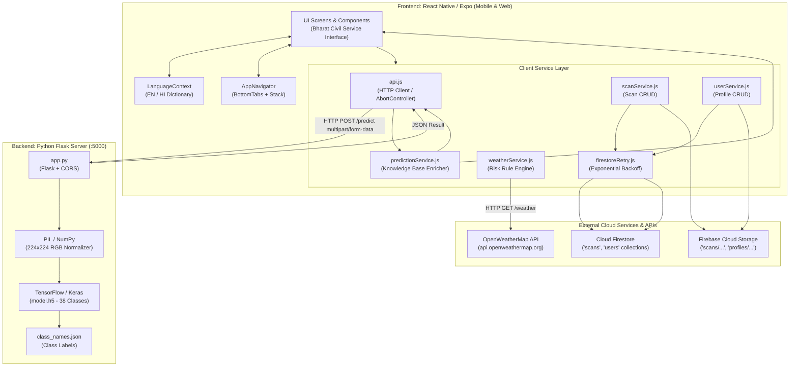
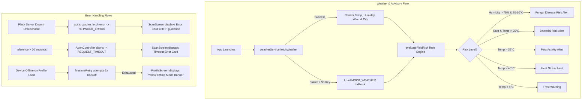
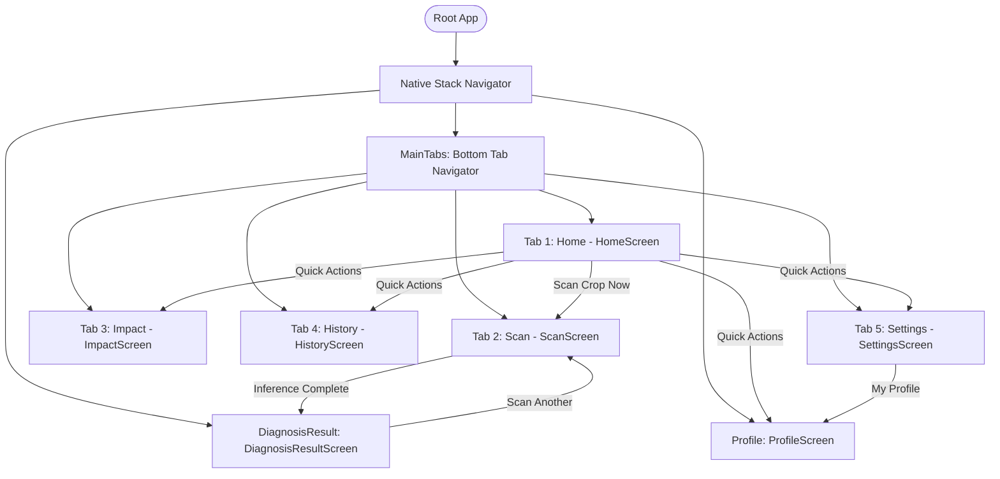
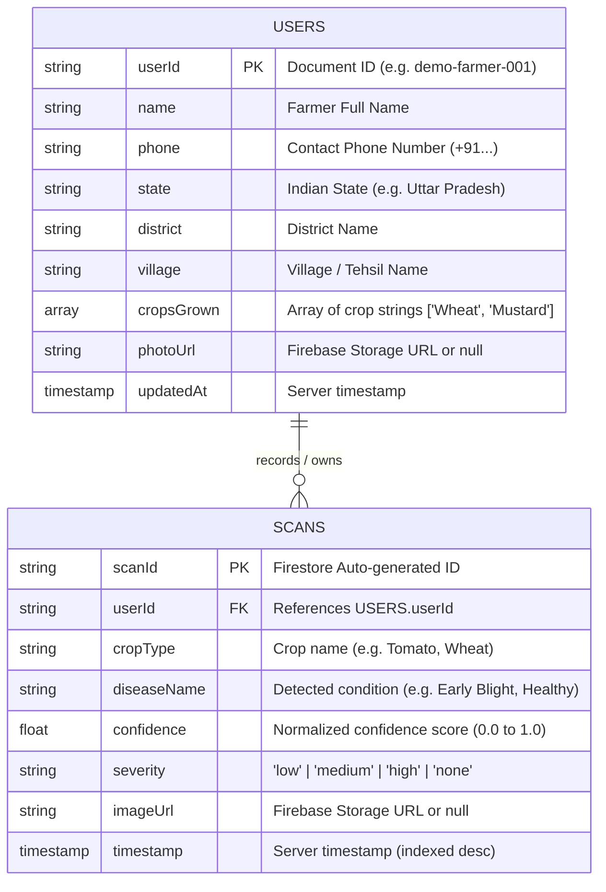

# REVERSE-ENGINEERING REPORT: KISANDRISHTI (किसान दृष्टि)
**Document Type:** Comprehensive Architecture, Codebase & Data Flow Analysis  
**Repository Path:** `d:\New folder`  
**Analysis Date:** August 2026  
**Status:** ✅ Fully Built / Production Prototype Codebase

---

## 1. WHAT THIS PRODUCT DOES

**KisanDrishti (किसान दृष्टि — Smart Crop Disease Detection)** is a cross-platform mobile and web application engineered specifically for Indian farmers and agricultural extension workers.

### Core Value Proposition & Functionality:
1. **AI-Powered Leaf Disease Classification:** Allows farmers to take photos or upload images of infected crop leaves (across 12 major Indian crops such as Wheat, Rice, Tomato, Potato, Cotton, Sugarcane, etc.). The image is analyzed by a custom TensorFlow/Keras deep learning convolutional neural network (CNN) hosted on a Python Flask REST backend, which classifies diseases across 38 distinct crop-disease categories.
2. **Actionable Bilingual Advisory & Treatment:** Returns instant disease identification with confidence scoring, severity ratings (Low, Medium, High), clinical symptoms, organic treatments (e.g., Neem oil, Trichoderma viride), chemical treatments (e.g., Mancozeb, Captan, Streptocycline), and preventive measures in both **English** and **हिन्दी (Hindi)**.
3. **Agro-Climatic Weather & Field Risk Advisory:** Integrates real-time localized weather data via OpenWeatherMap and executes a client-side agro-meteorological rule engine to calculate real-time disease risk alerts (Fungal risk due to high humidity, Bacterial infection risk under warm-wet conditions, Heat stress, Pest activity, and Frost warnings).
4. **Impact Analytics & Surveillance:** Visualizes aggregate farmer metrics including total scans, disease detection rates, healthy crop ratios, estimated yield saved (quintals), top detected disease distributions, and monthly seasonal scan trends.
5. **Historical Scan Log & Search:** Stores scan records and leaf images in Cloud Firestore and Firebase Storage, allowing farmers to search, filter (All, Diseased, Healthy), and review past diagnoses.
6. **Farmer Profile & Krishi Support:** Maintains farm demographics (state, district, village, primary crops grown) with offline resilience, along with direct one-touch access to the national Kisan Call Centre Helpline (`1800-180-1551`) and Krishi Vigyan Kendra (KVK) advisories.

---

## 2. TECH STACK

All technologies identified below were verified directly from the source code and configuration files.

| Category | Technology | Version | What it does | Where it is used | Verified Path | Confirmation |
| :--- | :--- | :--- | :--- | :--- | :--- | :--- |
| **Frontend Framework** | React Native (via Expo SDK) | `expo: ~54.0.8`, `react-native: 0.81.5`, `react: 19.1.0` | Cross-platform UI runtime for Android, iOS, and Web | Entire mobile/web client layer | `frontend/package.json` | ✅ Confirmed |
| **Web Adapter** | React Native Web | `react-native-web: ^0.21.2`, `react-dom: 19.1.0` | Compiles React Native primitives to standard DOM HTML/CSS | Web browser rendering | `frontend/package.json` | ✅ Confirmed |
| **Backend Framework** | Flask | `flask` (Python 3.x) | Lightweight WSGI web framework providing REST endpoints (`/predict`, `/`) | Backend server | `backend/requirements.txt`, `backend/app.py` | ✅ Confirmed |
| **Backend CORS** | Flask-CORS | `flask-cors` | Handles Cross-Origin Resource Sharing for API requests from web & mobile | Flask application init | `backend/requirements.txt`, `backend/app.py` | ✅ Confirmed |
| **Programming Languages** | JavaScript (ES6+ / React JSX), Python 3 | Python `3.x`, JS `ES2023` | Application business logic, ML inference, and UI rendering | Frontend JS, Backend Python | All `.js` and `.py` files | ✅ Confirmed |
| **Database** | Google Cloud Firestore (Modular SDK) | `firebase: ^12.18.0` | NoSQL document database storing user profiles (`users`) and scan history records (`scans`) | Cloud persistence and real-time data access | `frontend/src/services/firebase.js`, `frontend/src/services/scanService.js` | ✅ Confirmed |
| **Authentication** | Demo User ID / Firebase Auth Ready | Conceptual / Configured | Profile identification mapped via `DEFAULT_USER_ID = 'demo-farmer-001'` with Firebase Auth environment variables ready | User data partition | `frontend/src/services/userService.js`, `frontend/.env` | ✅ Confirmed |
| **AI / ML Runtime** | TensorFlow / Keras | `tensorflow` | Deep neural network inference engine running pre-trained CNN model `model.h5` | Crop leaf image classification | `backend/app.py` | ✅ Confirmed |
| **Image Processing (Backend)**| Pillow (PIL) & NumPy | `pillow`, `numpy` | Decodes image streams, resizes to `(224, 224)`, converts to RGB float32 arrays | ML input preprocessing pipeline | `backend/app.py` | ✅ Confirmed |
| **Image Capture / Picker** | Expo Image Picker | `expo-image-picker: ~17.0.11` | Accesses camera hardware and photo media library | Camera and gallery leaf selection, avatar upload | `frontend/src/screens/ScanScreen.js`, `frontend/src/screens/ProfileScreen.js` | ✅ Confirmed |
| **External Weather API** | OpenWeatherMap REST API 2.5 | `v2.5` | Current weather (temperature, humidity, wind, conditions) by city or geolocation | Field Risk Advisory & Weather Card | `frontend/src/services/weatherService.js` | ✅ Confirmed |
| **UI Design System / Styling**| Vanilla React Native `StyleSheet` | Built-in | Custom institutional design system (*Bharat Civil Service Interface*) | All UI components and screens | `frontend/src/constants/theme.js` | ✅ Confirmed |
| **Navigation** | React Navigation (Native Stack & Bottom Tabs) | `@react-navigation/native: ^7.3.18`, `@react-navigation/bottom-tabs: ^7.18.18`, `@react-navigation/native-stack: ^7.18.10` | Tab routing and stack transitions | App navigation structure | `frontend/src/navigation/AppNavigator.js` | ✅ Confirmed |
| **Iconography** | Expo Vector Icons (Ionicons) | `@expo/vector-icons: ^15.0.3` | Unified glyph and symbol set | Tabs, buttons, badges, status chips | `frontend/src/navigation/AppNavigator.js` | ✅ Confirmed |
| **State Management** | React Context API + Local `useState`/`useEffect` | Native React | Global language/localization context (`LanguageContext`) + screen-level state | Localization and component state | `frontend/src/context/LanguageContext.js` | ✅ Confirmed |
| **Internationalization (i18n)** | Custom Translation Dictionary | Custom JS | Complete English / Hindi bilingual string lookup dictionary | Entire user interface | `frontend/src/i18n/translations.js` | ✅ Confirmed |
| **File / Cloud Storage** | Firebase Cloud Storage | `firebase/storage` | Uploads scanned leaf photos and user avatars | `scans/{userId}/` and `profiles/{userId}/` | `frontend/src/services/scanService.js` | ✅ Confirmed |
| **Build & Dev Tooling** | Expo CLI, Node.js, npm, Python virtualenv | Expo CLI `54.x`, Node `v20+` | Project scaffolding, Metro bundler, development runtime | Build, run, and package scripts | `frontend/package.json` | ✅ Confirmed |
| **Model Artifacts** | HDF5 Keras Model (`model.h5`) | 7.13 MB | 38-class plant disease classification neural network weights | Inference execution in backend | `backend/model.h5` | ✅ Confirmed |

---

## 3. PROJECT STRUCTURE

```text
d:\New folder
├── backend/
│   ├── image/
│   │   └── test_leaf.jpg                     # Sample leaf image asset for testing inference
│   ├── __pycache__/                         # Python bytecode cache
│   ├── app.py                               # Flask REST API server exposing / and /predict
│   ├── class_names.json                     # JSON array of 38 plant disease class identifiers
│   ├── model.h5                             # Pre-trained TensorFlow/Keras neural network model
│   ├── plant-disease-detection.ipynb        # Jupyter training/evaluation notebook
│   ├── requirements.txt                     # Python pip dependency manifest
│   └── test_leaf.jpg                        # Root test image for command-line verification
│
└── frontend/
    ├── .claude/
    │   └── settings.json                    # Workspace tooling configuration
    ├── .expo/                               # Expo development build cache
    ├── .git/                                # Git version control metadata
    ├── assets/                              # App icons, adaptive icons, splash screens
    │   ├── android-icon-background.png
    │   ├── android-icon-foreground.png
    │   ├── android-icon-monochrome.png
    │   ├── favicon.png
    │   ├── icon.png
    │   └── splash-icon.png
    ├── node_modules/                        # Node.js third-party package dependencies
    ├── src/
    │   ├── components/                      # Reusable Bharat Civil Service design components
    │   │   ├── Badge.js                     # Status and severity badge chip
    │   │   ├── Button.js                    # Primary (Yellow), Secondary (Green), Outline buttons
    │   │   ├── Card.js                      # Flat institutional bordered container card
    │   │   ├── Header.js                    # Top app bar with emblem, branding & language switch
    │   │   ├── RiskChip.js                  # Agro-climatic field risk status chip
    │   │   └── SectionTitle.js              # Section header with horizontal dividing rule
    │   ├── constants/
    │   │   └── theme.js                     # Design tokens: Colors, Typography, Spacing, Radius
    │   ├── context/
    │   │   └── LanguageContext.js           # React Context providing English/Hindi state and t() helper
    │   ├── i18n/
    │   │   └── translations.js              # Full English & Hindi string dictionary (316 lines)
    │   ├── navigation/
    │   │   └── AppNavigator.js              # Native Stack + 5-Tab Bottom Navigator
    │   ├── screens/                         # Application screen views
    │   │   ├── DiagnosisResultScreen.js     # Post-scan analysis results, symptoms & treatments
    │   │   ├── HistoryScreen.js             # Historical scan records with search and filters
    │   │   ├── HomeScreen.js                # Main dashboard: weather, advisory, quick actions
    │   │   ├── ImpactScreen.js              # Aggregate farmer impact analytics & charts
    │   │   ├── ProfileScreen.js             # Farmer identity, crops grown, and village details
    │   │   ├── ScanScreen.js                # Image capture/upload & crop selection interface
    │   │   └── SettingsScreen.js            # App preferences, notifications, sync, and language
    │   └── services/                        # Business logic, networking & API integrations
    │       ├── api.js                       # HTTP client for Flask backend with timeout & platform blob handling
    │       ├── firebase.js                  # Firebase app, Firestore db, and Storage initialization
    │       ├── firestoreRetry.js            # Exponential-backoff retry wrapper for offline resilience
    │       ├── predictionService.js         # Disease prediction service + Treatment Knowledge Base
    │       ├── scanService.js               # Firestore CRUD and Storage uploads for scans & stats
    │       ├── userService.js               # Farmer profile persistence in Firestore & avatar uploads
    │       └── weatherService.js            # OpenWeatherMap client & Field Risk rule engine
    ├── .env                                 # Environment variables (Backend URL, OpenWeather, Firebase)
    ├── .env.example                         # Template environment file
    ├── .gitignore                           # Git ignore definitions
    ├── AGENTS.md                            # Development instructions for Expo SDK 54
    ├── App.js                               # Root React component with Providers and StatusBar
    ├── app.json                             # Expo app configuration manifest
    ├── CLAUDE.md                            # Claude tooling instruction link
    ├── index.js                             # Entry point registering root component
    ├── LICENSE                              # MIT License
    ├── package-lock.json                    # Deterministic npm dependency lockfile
    └── package.json                         # Node dependency manifest and npm scripts
```

---

## 4. ARCHITECTURE

### System Architecture Diagram



### Architectural Highlights:
* **Separation of Concerns:** The ML inference pipeline is completely isolated within the Flask backend. The client only needs to pass raw image bytes (`multipart/form-data`) and receive a compact JSON payload.
* **Knowledge Enrichment on Client:** Instead of bloating the backend with clinical treatment text, `predictionService.js` maintains a fast in-memory multilingual Knowledge Base (`CONDITION_KB`) that maps raw model condition codes (e.g. `Early_blight`) into comprehensive Hindi/English treatments, organic sprays, and prevention tips.
* **Resilient Offline Fallbacks:** If Firestore connections drop on physical devices, `firestoreRetry.js` performs exponential backoff retries, while `scanService.js` and `userService.js` maintain graceful mock and default fallbacks to prevent UI crashes.

---

## 5. ALL SCREENS

| Screen | Route / Nav Identifier | Purpose | Components Used | Main Actions & Triggers |
| :--- | :--- | :--- | :--- | :--- |
| **Home Dashboard** | `MainTabs` → `Home` | Primary landing dashboard showing live weather, field disease risk advisory, quick navigation grid, recent outbreaks, and helpline | `Header`, `Card`, `Button`, `RiskChip`, `SectionTitle`, `Ionicons`, `RefreshControl` | • Pull to refresh weather<br>• Tap **Scan Crop Now** (navigates to Scan)<br>• Tap Quick Action icons (History, Impact, Settings, Profile)<br>• Switch language (EN/HI)<br>• View disease alerts & helpline |
| **Scan Crop** | `MainTabs` → `Scan` | Camera capture / gallery image picker and 12-crop selector for AI analysis | `Header`, `Card`, `Button`, `SectionTitle`, `Ionicons`, `ImagePicker`, `ActivityIndicator` | • Tap **Take Photo** (launches camera)<br>• Tap **Choose from Gallery** (launches picker)<br>• Select Crop Chip (Wheat, Rice, Tomato, etc.)<br>• Tap **Scan Your Crop / Analyze** (sends to Flask)<br>• Remove selected photo<br>• View Photo Framing Guide & Tips |
| **Diagnosis Result** | `DiagnosisResult` (Stack) | Detailed breakdown of AI prediction: disease name, confidence bar, severity gauge, symptoms, organic/chemical treatment tabs, and KVK contact | `Header`, `Card`, `Button`, `Badge`, `SectionTitle`, `TouchableTab`, `Ionicons`, `Image` | • Toggle Organic vs Chemical Treatment tabs<br>• Tap **Save to Log** (uploads to Storage & Firestore)<br>• Tap **Scan Another Crop** (returns to Scan)<br>• Tap Back arrow (returns to previous screen) |
| **Impact Dashboard** | `MainTabs` → `Impact` | Surveillance analytics: total scans, disease count, healthy percentage, yield saved, top 5 disease distribution, monthly bar chart, and government notices | `Header`, `Card`, `MetricCard`, `SectionTitle`, `Ionicons`, `RefreshControl` | • Pull to refresh stats from Firestore<br>• Review 4 primary KPI metric cards<br>• Inspect disease prevalence percentage bars<br>• Review 6-month scan activity bar chart<br>• Read PKVY and regional surveillance advisories |
| **Scan History** | `MainTabs` → `History` | Chronological log of past scans with real-time text search and filter chips | `Header`, `Badge`, `TextInput`, `TouchableOpacity`, `Image`, `Ionicons`, `RefreshControl` | • Pull to refresh history list<br>• Search by crop name, disease, or formatted date<br>• Filter by status: **All**, **Diseased**, **Healthy**<br>• Tap card to inspect details<br>• Clear active search query |
| **Settings** | `MainTabs` → `Settings` | User configuration: Language switcher, push notification toggles, offline sync, cache management, app version & logout | `Header`, `Card`, `Switch`, `TouchableOpacity`, `Ionicons` | • Toggle Language (English / हिन्दी buttons)<br>• Toggle Weather Alerts switch<br>• Toggle Disease Outbreak Alerts switch<br>• Toggle Offline Sync switch<br>• Tap Clear Cache<br>• Navigate to Profile<br>• Tap Logout |
| **Farmer Profile** | `Profile` (Stack) | Farmer demographic management: Name, phone, state picker, district, village, multi-select crops grown, and avatar upload | `Header`, `Card`, `Button`, `SectionTitle`, `TextInput`, `TouchableOpacity`, `Image`, `ImagePicker`, `ActivityIndicator` | • Tap avatar to upload profile picture from gallery<br>• Input Name, Phone, District, Village<br>• Open State Dropdown picker (19 Indian States)<br>• Multi-select crops grown from 12-item chip grid<br>• Tap **Save Profile** (commits to Firestore `users`) |

---

## 6. WIREFRAMES

Reconstructed directly from the JSX rendering tree and StyleSheet definitions.

### 6.1 Home Dashboard (`HomeScreen.js`)
```text
┌──────────────────────────────────────────────────────────────────┐
│ [🌿 EMBLEM] KisanDrishti / किसान दृष्टि       [🌐 हिन्दी / EN]   │
│             Smart Crop Disease Detection                         │
├──────────────────────────────────────────────────────────────────┤
│ Namaste, Farmer 🙏                                               │
│                                                                  │
│ ┌─ Today's Weather ────────────────────────────────────────────┐ │
│ │  [☀️ Action Icon]   32°C        💧 Humidity:   78%            │ │
│ │                                  💨 Wind:       12 km/h        │ │
│ │                                  🌡️ Condition:  scattered      │ │
│ │  ──────────────────────────────────────────────────────────  │ │
│ │  📍 New Delhi                                                │ │
│ └──────────────────────────────────────────────────────────────┘ │
│                                                                  │
│ ── FIELD RISK ADVISORY ───────────────────────────────────────── │
│ ┌──────────────────────────────────────────────────────────────┐ │
│ │ [🛡️/⚠️] High Risk — Take preventive action                  │ │
│ └──────────────────────────────────────────────────────────────┘ │
│   • ❗ Fungal disease risk due to high humidity                  │
│                                                                  │
│ ┌──────────────────────────────────────────────────────────────┐ │
│ │ [📷] SCAN CROP NOW (Mustard Yellow CTA Button)               │ │
│ └──────────────────────────────────────────────────────────────┘ │
│                                                                  │
│ ── QUICK ACTIONS ─────────────────────────────────────────────── │
│ ┌───────────────┐ ┌───────────────┐                              │
│ │  [🕒] History │ │  [📊] Impact  │                              │
│ └───────────────┘ └───────────────┘                              │
│ ┌───────────────┐ ┌───────────────┐                              │
│ │ [⚙️] Settings │ │  [👤] Profile │                              │
│ └───────────────┘ └───────────────┘                              │
│                                                                  │
│ ── RECENT ALERTS ─────────────────────────────────────────────── │
│ ┌──────────────────────────────────────────────────────────────┐ │
│ │ 🔴 Disease Alert: Wheat Leaf Rust outbreak reported in UP  > │ │
│ │ ───────────────────────────────────────────────────────────  │ │
│ │ 🟡 Govt Schemes: PM-KISAN 17th installment released        > │ │
│ └──────────────────────────────────────────────────────────────┘ │
│                                                                  │
│ ┌──────────────────────────────────────────────────────────────┐ │
│ │ 📞 Krishi Helpline: 1800-180-1551 (Deep Green Banner)        │ │
│ └──────────────────────────────────────────────────────────────┘ │
├──────────────────────────────────────────────────────────────────┤
│  [🏠 Home]    [📷 Scan]    [📊 Impact]    [🕒 History]   [⚙️ Set] │
└──────────────────────────────────────────────────────────────────┘
```

### 6.2 Scan Crop (`ScanScreen.js`)
```text
┌──────────────────────────────────────────────────────────────────┐
│ [🌿 EMBLEM] KisanDrishti / किसान दृष्टि       [🌐 हिन्दी / EN]   │
├──────────────────────────────────────────────────────────────────┤
│ Scan Your Crop                                                   │
│ Take a close-up photo of the affected leaf or plant part         │
│                                                                  │
│ ┌─ Framing Guide / Image Preview ──────────────────────────────┐ │
│ │ ┌──                                                      ──┐ │ │
│ │ │                                                          │ │ │
│ │ │                     [🌿 Leaf Icon]                       │ │ │
│ │ │             Position the leaf within the frame           │ │ │
│ │ │                                                          │ │ │
│ │ └──                                                      ──┘ │ │
│ └──────────────────────────────────────────────────────────────┘ │
│                                                                  │
│ ┌───────────────────────────┐  ┌───────────────────────────────┐ │
│ │ [📷] Take Photo (Green)   │  │ [🖼️] Choose Gallery (Outline) │ │
│ └───────────────────────────┘  └───────────────────────────────┘ │
│                                                                  │
│ ── SELECT CROP TYPE ──────────────────────────────────────────── │
│ [🌾 Wheat]  [🌾 Rice]     [🏵️ Cotton]   [🍅 Tomato]             │
│ [🥔 Potato] [🎋 Sugarcane][🌻 Mustard]  [🌽 Maize]              │
│ [🧅 Onion]  [🌶️ Chilli]   [🫘 Soybean]  [🥜 Groundnut]          │
│                                                                  │
│ ┌──────────────────────────────────────────────────────────────┐ │
│ │ [🔍] SCAN YOUR CROP / ANALYZE (Primary Yellow Button)        │ │
│ └──────────────────────────────────────────────────────────────┘ │
│                                                                  │
│ ── PHOTO TIPS ────────────────────────────────────────────────── │
│ ┌──────────────────────────────────────────────────────────────┐ │
│ │  ✅ Ensure good lighting                                      │ │
│ │  ✅ Focus on the affected area                                │ │
│ │  ✅ Include both healthy and diseased parts                   │ │
│ │  ✅ Avoid shadows on the leaf                                 │ │
│ └──────────────────────────────────────────────────────────────┘ │
├──────────────────────────────────────────────────────────────────┤
│  [🏠 Home]    [📷 Scan]    [📊 Impact]    [🕒 History]   [⚙️ Set] │
└──────────────────────────────────────────────────────────────────┘
```

### 6.3 Diagnosis Result (`DiagnosisResultScreen.js`)
```text
┌──────────────────────────────────────────────────────────────────┐
│ [← Back]  Diagnosis Result                    [🌐 हिन्दी / EN]   │
├──────────────────────────────────────────────────────────────────┤
│ ┌──────────────────────────────────────────────────────────────┐ │
│ │ [                    Scanned Leaf Image                    ] │ │
│ └──────────────────────────────────────────────────────────────┘ │
│                                                                  │
│ ┌─ Overview Card ──────────────────────────────────────────────┐ │
│ │ Early Blight                             [ HIGH SEVERITY ]   │ │
│ │ Tomato • Tomato___Early_blight                               │ │
│ │                                                              │ │
│ │ CONFIDENCE                                                   │ │
│ │ [████████████████████████████████████████░░░]  92%           │ │
│ │                                                              │ │
│ │ SEVERITY                                                     │ │
│ │ [  Low  ]  [ Medium ]  [  High (Active Solid Red)  ]         │ │
│ └──────────────────────────────────────────────────────────────┘ │
│                                                                  │
│ ── SYMPTOMS ──────────────────────────────────────────────────── │
│ ┌──────────────────────────────────────────────────────────────┐ │
│ │ • Dark brown concentric rings on older leaves (target spots) │ │
│ │ • Leaf yellowing around lesion area                          │ │
│ │ • Premature defoliation in severe cases                      │ │
│ └──────────────────────────────────────────────────────────────┘ │
│                                                                  │
│ ┌─────────────────────────────┐ ┌──────────────────────────────┐ │
│ │ [🌿] Organic Treatment (Act)│ │ [🧪] Chemical Treatment      │ │
│ └─────────────────────────────┘ └──────────────────────────────┘ │
│ ┌──────────────────────────────────────────────────────────────┐ │
│ │ 🌿 Apply compost tea spray every 10 days                     │ │
│ │ 🌿 Use Trichoderma viride bio-fungicide                      │ │
│ │ 🌿 Mulch around plant base                                   │ │
│ └──────────────────────────────────────────────────────────────┘ │
│                                                                  │
│ ── PREVENTION ────────────────────────────────────────────────── │
│ ┌──────────────────────────────────────────────────────────────┐ │
│ │ 🛡️ Practice crop rotation                                    │ │
│ │ 🛡️ Remove infected plant debris                              │ │
│ │ 🛡️ Avoid overhead irrigation                                 │ │
│ └──────────────────────────────────────────────────────────────┘ │
│                                                                  │
│ ┌──────────────────────────────────────────────────────────────┐ │
│ │ 📍 Nearest Krishi Vigyan Kendra                            > │ │
│ └──────────────────────────────────────────────────────────────┘ │
│                                                                  │
│ ┌──────────────────────────────────────────────────────────────┐ │
│ │ [💾] SAVE TO LOG (Secondary Green)                           │ │
│ └──────────────────────────────────────────────────────────────┘ │
│ ┌──────────────────────────────────────────────────────────────┐ │
│ │ [📷] SCAN ANOTHER CROP (Outline)                             │ │
│ └──────────────────────────────────────────────────────────────┘ │
└──────────────────────────────────────────────────────────────────┘
```

---

## 7. COMPLETE USER WORKFLOWS

### 7.1 Primary Crop Scan & Diagnosis Flow
```text
Farmer opens App (Home Screen)
   │
   ▼
Taps "Scan Crop Now" or selects "Scan" Bottom Tab
   │
   ▼
[ScanScreen.js]
   ├── 1. Taps "Take Photo" (Camera) or "Choose from Gallery"
   │       └── Grants permission → Picks image → Sets imageUri state
   ├── 2. Selects Crop Chip from grid (e.g., "Tomato")
   │       └── Sets selectedCrop = "Tomato"
   └── 3. Taps "Scan Your Crop / Analyze" button
           │
           ▼
[State: analyzing = true] (Starts 6-second slow-timer)
   │
   ▼
[api.js -> postPredict(imageUri)]
   ├── Converts URI into FormData multipart binary (Web Blob or React Native asset)
   ├── Dispatches HTTP POST to http://192.168.1.34:5000/predict with 20s AbortController
   │
   ▼
[Flask Backend -> app.py /predict]
   ├── Validates 'image' file in request.files
   ├── PIL opens stream, converts to RGB, resizes to (224, 224)
   ├── NumPy formats array (1, 224, 224, 3) float32
   ├── TensorFlow model.predict(input_batch)
   ├── Argmax extracts predicted_index & confidence score
   └── Splits class_name (e.g., "Tomato___Early_blight" -> crop: "Tomato", condition: "Early_blight")
   │
   ▼
[Flask Response JSON] -> { class_name, confidence, crop, condition }
   │
   ▼
[predictionService.js -> predictCropDisease]
   ├── Matches condition against CONDITION_KB (e.g., Early_blight)
   ├── Enriches payload with bilingual symptoms, organic/chemical treatments, prevention
   └── Computes severity tier (High >= 80%, Medium >= 50%, Low < 50%)
   │
   ├── [Asynchronous Background Task]
   │   └── scanService.js -> uploadScanImage() -> saveScanResult() to Firestore
   │
   ▼
Navigation.navigate('DiagnosisResult', { imageUri, cropType, prediction })
   │
   ▼
[DiagnosisResultScreen.js]
   ├── Displays Image, Disease Title, Confidence Bar, Severity Segment
   ├── Farmer toggles Organic vs Chemical treatment tabs
   └── Farmer taps "Save to Log" (confirms Firestore save) or "Scan Another Crop"
```

### 7.2 Secondary Workflows & Edge-Case Handling



---

## 8. ROUTING & NAVIGATION

### Route Configuration Matrix

| Route Name | Screen Component | Navigator Layer | Auth Required? | Purpose |
| :--- | :--- | :--- | :--- | :--- |
| `MainTabs` | `TabNavigator` | Root Native Stack | No (Public) | Holds the 5 primary application tab views |
| `Home` | `HomeScreen.js` | Bottom Tab | No | Landing dashboard, weather & advisory |
| `Scan` | `ScanScreen.js` | Bottom Tab | No | Image picker and inference launcher |
| `Impact` | `ImpactScreen.js` | Bottom Tab | No | Surveillance metrics, trends, and charts |
| `History` | `HistoryScreen.js` | Bottom Tab | No | Historical scan list with search & filter |
| `Settings` | `SettingsScreen.js` | Bottom Tab | No | App preferences, language, cache & sync |
| `DiagnosisResult`| `DiagnosisResultScreen.js` | Root Native Stack | No | Post-inference treatment breakdown |
| `Profile` | `ProfileScreen.js` | Root Native Stack | No | Farmer profile and village/crop setup |

### Navigation Structure Diagram



---

## 9. USER ROLES & PERMISSIONS

### Role Definitions
1. **Farmer / End-User (Anonymous / Demo ID):** Currently identified by default tenant key `DEFAULT_USER_ID = 'demo-farmer-001'`. Can perform all operations (scanning crops, viewing advisory, saving records, reading impact metrics, and updating farm demographic profile).
2. **System / Backend Administrator (Conceptual / Inferred):** Manages the Flask backend server, model deployment (`model.h5`), and Firebase Cloud credentials.

### Permission Matrix

| Feature / Action | Anonymous Farmer | Authenticated Farmer (Future) | Admin / Extension Officer |
| :--- | :---: | :---: | :---: |
| View Live Weather & Field Risk | ✅ Yes | ✅ Yes | ✅ Yes |
| Run AI Leaf Classification | ✅ Yes | ✅ Yes | ✅ Yes |
| View Treatments (Organic & Chemical) | ✅ Yes | ✅ Yes | ✅ Yes |
| Save Scan Results to Cloud | ✅ Yes (`demo-farmer-001`) | ✅ Yes (Scoped to UID) | ✅ Yes |
| Search & Filter Personal History | ✅ Yes | ✅ Yes (Scoped to UID) | ✅ Yes (Global view) |
| View Impact Analytics Dashboard | ✅ Yes (Aggregated) | ✅ Yes | ✅ Yes |
| Edit Farm Profile & Village Data | ✅ Yes | ✅ Yes (Scoped to UID) | ✅ Yes |
| Change App Language (EN / HI) | ✅ Yes | ✅ Yes | ✅ Yes |
| Manage Push Alert Toggles | ✅ Yes (Local State) | ✅ Yes | ✅ Yes |
| Retrain / Replace ML Model | ❌ No | ❌ No | ✅ Yes (Backend Filesystem) |

---

## 10. COMPONENTS

| Component | File Path | Props / Options | Purpose | Used By |
| :--- | :--- | :--- | :--- | :--- |
| **`Header`** | `frontend/src/components/Header.js` | `title`, `showBack`, `onBack`, `rightComponent` | Institutional header banner featuring the leaf emblem circle, app name/tagline, optional back arrow, and one-touch Hindi/English language toggle | All 7 screens (`HomeScreen`, `ScanScreen`, `DiagnosisResultScreen`, `ImpactScreen`, `HistoryScreen`, `SettingsScreen`, `ProfileScreen`) |
| **`Button`** | `frontend/src/components/Button.js` | `title`, `onPress`, `variant` ('primary' \| 'secondary' \| 'outline'), `disabled`, `loading`, `icon`, `style`, `textStyle` | Standardized button with active opacity, loading spinner indicator, optional icon, and three color variants (Mustard Yellow, Deep Green, Green Outline) | `HomeScreen`, `ScanScreen`, `DiagnosisResultScreen`, `ProfileScreen` |
| **`Card`** | `frontend/src/components/Card.js` | `children`, `title`, `headerRight`, `style`, `contentStyle` | Flat institutional container card with 1px border (`#D1D1D1`), light grey header strip, and no drop shadows | `HomeScreen`, `ScanScreen`, `DiagnosisResultScreen`, `ImpactScreen`, `SettingsScreen`, `ProfileScreen` |
| **`Badge`** | `frontend/src/components/Badge.js` | `label`, `status` ('healthy' \| 'diseased' \| 'warning' \| 'info' \| 'low' \| 'medium' \| 'high'), `style` | Status pill chip with tinted background and 1px matching border for severity and health indicators | `DiagnosisResultScreen`, `HistoryScreen` |
| **`RiskChip`** | `frontend/src/components/RiskChip.js` | `label`, `level` ('low' \| 'medium' \| 'high'), `style` | Full-width status chip with contextual status icons (`shield-checkmark`, `warning`, `alert-circle`) for agro-meteorological advisories | `HomeScreen` |
| **`SectionTitle`** | `frontend/src/components/SectionTitle.js` | `title`, `rightComponent`, `style` | Institutional section header with typography styling and a full-width 1px hairline horizontal divider | `HomeScreen`, `ScanScreen`, `DiagnosisResultScreen`, `ImpactScreen`, `ProfileScreen` |
| **`MetricCard`** *(Local)* | `frontend/src/screens/ImpactScreen.js` | `icon`, `iconColor`, `iconBg`, `label`, `value` | KPI square card showing large numeric statistics with a circular tinted icon badge | `ImpactScreen` |
| **`TouchableTab`** *(Local)* | `frontend/src/screens/DiagnosisResultScreen.js` | `label`, `active`, `onPress`, `icon` | Dual-state segmented tab control for switching between Organic (Leaf icon) and Chemical (Flask icon) treatments | `DiagnosisResultScreen` |

---

## 11. API / BACKEND FLOW

### Endpoint Specification

| Method | Endpoint / Service | Purpose | Request Payload | Response Payload | Invocation Location |
| :--- | :--- | :--- | :--- | :--- | :--- |
| **`GET`** | `http://<IP>:5000/` | Health check to verify backend reachability | None | `{"status": "ok"}` | `frontend/src/services/api.js` |
| **`POST`** | `http://<IP>:5000/predict` | Image classification using CNN model | `multipart/form-data` with binary image under form field `"image"` | `{"class_name": "Tomato___Early_blight", "confidence": 92.5, "crop": "Tomato", "condition": "Early_blight"}` | `frontend/src/services/api.js` via `predictionService.js` |
| **`GET`** | `https://api.openweathermap.org/data/2.5/weather` | Fetch current weather by city or lat/long | Query params: `?q=New Delhi&appid=<KEY>&units=metric` | Standard OpenWeatherMap JSON (temp, humidity, wind, weather condition) | `frontend/src/services/weatherService.js` |
| **`SDK`** | `Firestore: 'scans'` | Create and list historical crop scan records | Document JSON with `userId`, `cropType`, `diseaseName`, `confidence`, `severity`, `imageUrl`, `timestamp` | Query snapshot containing array of scan documents | `frontend/src/services/scanService.js` |
| **`SDK`** | `Firestore: 'users'` | Retrieve and update farmer demographic profile | Document JSON with `name`, `phone`, `state`, `district`, `village`, `cropsGrown`, `photoUrl` | User profile document JSON | `frontend/src/services/userService.js` |
| **`SDK`** | `Storage: 'scans/'` & `'profiles/'` | Store binary JPG images in cloud | Blob / Binary stream | Public download URL string (`https://firebasestorage.googleapis.com/...`) | `frontend/src/services/scanService.js`, `frontend/src/services/userService.js` |

### End-to-End Image Classification Flow
1. **Frontend Packaging:** `api.js` receives `imageUri`. On Web, it fetches the URI into a binary `Blob`; on Native iOS/Android, it constructs a React Native asset dictionary `{ uri, type: 'image/jpeg', name: filename }`.
2. **Transmission:** A `FormData` object with field name `"image"` is sent via `fetch()` with an `AbortController` set to abort after 20,000ms.
3. **Backend Reception:** Flask reads `request.files['image']`. If missing or invalid, it returns `400 Bad Request`.
4. **Preprocessing:** PIL opens the byte stream, ensures RGB channels, and resizes to `(224, 224)`. NumPy creates an `(1, 224, 224, 3)` `float32` tensor.
5. **Inference:** `model.predict()` evaluates the tensor against the 38 classes defined in `class_names.json`.
6. **Post-Processing:** The class with the highest probability is extracted (`np.argmax`). `confidence` is calculated as a float percentage (`prob * 100.0`). The class string is parsed on `___` into `crop` and `condition`.
7. **Knowledge Enrichment:** `predictionService.js` intercepts the Flask JSON, queries its internal `CONDITION_KB` dictionary, attaches symptoms, organic and chemical remedies, and returns a fully localized diagnosis object to the UI.

---

## 12. DATABASE & DATA MODEL

The database layer utilizes **Google Cloud Firestore** (NoSQL Document Store).

### Entity-Relationship Diagram



### Firestore Indexes & Queries:
* **Query `fetchScanHistory`:** `query(collection(db, 'scans'), where('userId', '==', userId), orderBy('timestamp', 'desc'), limit(50))`
* **Query `fetchAggregateStats`:** `query(collection(db, 'scans'), where('userId', '==', userId))` (Client performs aggregation for top diseases and monthly distribution).

---

## 13. AUTHENTICATION & SECURITY

1. **Current Implementation:**
   * Uses a hardcoded default user identifier: `DEFAULT_USER_ID = 'demo-farmer-001'` defined in `scanService.js` and `userService.js`.
   * All profile saves and scan history queries are scoped to this identifier.
2. **Firebase Auth Configuration:**
   * Environment variables for Firebase Authentication (`EXPO_PUBLIC_FIREBASE_AUTH_DOMAIN`, `EXPO_PUBLIC_FIREBASE_API_KEY`, etc.) are configured in `frontend/.env`.
   * Direct Firebase Auth session login (e.g. Phone SMS OTP or Email/Password) is prepared in configuration but not yet wired to a login screen.
3. **Route Protection:**
   * All routes in `AppNavigator.js` are currently public to allow farmers immediate, frictionless access to disease diagnosis without mandatory sign-in.

---

## 14. DETAILED DATA FLOW TRACES

### Trace A: Crop Disease Prediction
```text
[USER]: Taps "Scan Your Crop / Analyze" button on ScanScreen
   │
   ▼
[UI]: ScanScreen.js (handleAnalyze)
   │
   ▼
[STATE]: setAnalyzing(true), setSlowRequest(false), setError(null)
   │
   ▼
[SERVICE]: predictionService.js (predictCropDisease(imageUri, selectedCrop))
   │
   ▼
[API CLIENT]: api.js (postPredict(imageUri))
   │
   ▼
[NETWORK]: HTTP POST multipart/form-data -> http://192.168.1.34:5000/predict
   │
   ▼
[BACKEND]: app.py (predict())
   ├── Image.open(image_file.stream).convert("RGB").resize((224, 224))
   ├── tf.keras.models.load_model -> model.predict(input_batch)
   └── Returns JSON: { class_name, confidence, crop, condition }
   │
   ▼
[KNOWLEDGE BASE]: predictionService.js matches condition in CONDITION_KB
   │
   ▼
[STATE UPDATE]: navigation.navigate('DiagnosisResult', { prediction, ... })
   │
   ▼
[UI UPDATE]: DiagnosisResultScreen.js renders symptoms, severity gauge, treatments
```

### Trace B: Weather & Field Risk Advisory
```text
[USER]: Opens Home Dashboard or pulls down to refresh
   │
   ▼
[UI]: HomeScreen.js (useEffect / onRefresh -> loadWeather())
   │
   ▼
[SERVICE]: weatherService.js (fetchWeather('New Delhi'))
   │
   ▼
[EXTERNAL API]: HTTP GET https://api.openweathermap.org/data/2.5/weather?...
   │
   ▼
[SERVICE RULE ENGINE]: weatherService.js (evaluateFieldRisk(weatherData))
   ├── Humidity > 75% & 20°C <= Temp <= 30°C -> 'homeFieldRiskFungal' (High)
   ├── Rain/Drizzle & Temp > 25°C -> 'homeFieldRiskBacterial' (High)
   ├── Temp > 35°C -> 'homeFieldRiskPest' (Medium/High)
   └── Temp > 40°C -> 'homeFieldRiskHeatStress' (High)
   │
   ▼
[STATE UPDATE]: setWeather(data), setFieldRisk(riskObject)
   │
   ▼
[UI UPDATE]: HomeScreen.js updates Weather Card, RiskChip, and detail alert bullets
```

---

## 15. DESIGN SYSTEM

The design follows the **Bharat Civil Service Interface (BCSI)** theme tokenized in `frontend/src/constants/theme.js`.

### 15.1 Color Palette
* **Primary Deep Green:** `#1F4D2C` (Header bars, branding, primary outlines, active tabs)
* **Dark Primary (Header Tone):** `#043617`
* **Light Green Tint:** `#BCEFC2` / `#E8F5E9` (Success containers, healthy chips)
* **Mustard Yellow Action CTA:** `#E5A022` / Container `#FFB639` (Primary action buttons, prominent icons)
* **Official Government Blue:** `#0C0566` / `#E8EAF6` (Info badges, chemical tabs, weather icons)
* **Error / Disease Alert Red:** `#BA1A1A` / `#C62828` / Container `#FFEBEE` (High risk, diseased badges)
* **Warning Amber:** `#F57F17` / Container `#FFF8E1` (Medium risk, moderate severity)
* **Neutral Background & Surfaces:** Background `#F9F9F9`, Card Surfaces `#FFFFFF`, Border `#D1D1D1`
* **Typography Text:** On Surface `#1A1C1C`, Secondary/Ash Gray `#666666`, Outline `#717970`

### 15.2 Typography Tokens
* **Headline Large:** `Inter`, `24px`, `Bold (700)`, Line height `32px`
* **Headline Medium:** `Inter`, `20px`, `SemiBold (600)`, Line height `28px`
* **Body Large:** `Inter`, `16px`, `Regular (400)`, Line height `24px`
* **Body Medium:** `Inter`, `14px`, `Regular (400)`, Line height `20px`
* **Button Text:** `Inter`, `14px`, `SemiBold (600)`, Line height `20px`
* **Label Bold / Upper:** `Inter`, `12px`, `SemiBold (600)`, Line height `16px`, Letter spacing `+0.6`

### 15.3 Geometry & Elevation
* **Spacing Scale:** Multiples of 4 (`xs: 4`, `sm: 8`, `md: 16`, `lg: 24`, `xl: 32`, `marginMobile: 16`)
* **Corner Radii:** Flat institutional aesthetic (`sm: 2`, `default: 4`, `md: 6`, `lg: 8`, `full: 9999`)
* **Borders:** Explicit `1px` solid border (`#D1D1D1`) on cards, inputs, and tab bars
* **Elevation / Shadows:** Flat UI philosophy (`shadowOpacity: 0`, `elevation: 0`)

---

## 16. RESPONSIVE BEHAVIOR

* **Mobile (Primary Target):** Configured for standard portrait mobile layout with `16px` horizontal padding (`SPACING.marginMobile`). Touch targets are sized at `>= 44px`.
* **Tablet Support:** Explicitly enabled in `frontend/app.json` (`"ios": { "supportsTablet": true }`). Multi-column grids (such as the 2-column quick action grid and 4-column crop selector) expand proportionally.
* **Web (Desktop / Browser):** Compiled via `react-native-web`. `ScrollView` containers flex to the viewport width, and `api.js` automatically swaps React Native binary objects for standard W3C `Blob` streams.

---

## 17. EXTERNAL SERVICES

| Service / Dependency | Provider | Location in Code | Purpose & Runtime Role |
| :--- | :--- | :--- | :--- |
| **OpenWeatherMap API** | OpenWeather Ltd. | `weatherService.js` | Retrieves live ambient weather parameters (temperature, humidity, wind, clouds) to drive the Field Risk Rule Engine |
| **Cloud Firestore** | Google Firebase | `firebase.js` | Cloud NoSQL database storing user profiles (`users`) and scan event records (`scans`) |
| **Firebase Cloud Storage** | Google Firebase | `firebase.js` | Object storage repository for leaf scan photos (`scans/...`) and farmer avatar images (`profiles/...`) |
| **Google Fonts (Inter)** | Google Fonts / Expo Font | `frontend/app.json` | Typography rendering for all text elements |

---

## 18. DEPLOYMENT & RUNTIME CONFIGURATION

### Local & Production Execution Details
* **Frontend Execution:** Started via Expo CLI:
  * Web: `npx expo start --web` (Running on `http://localhost:8081`)
  * Android: `npx expo start --android`
  * iOS: `npx expo start --ios`
* **Backend Execution:** Python Flask application:
  * Start command: `python app.py` (Runs on `http://0.0.0.0:5000` with `debug=True`)
* **Environment Variables (`frontend/.env`):**
  * `EXPO_PUBLIC_BACKEND_URL`: Points to the Flask host (e.g. `http://192.168.1.34:5000` or `http://localhost:5000`)
  * `EXPO_PUBLIC_OPENWEATHER_API_KEY`: OpenWeather API authentication key
  * `EXPO_PUBLIC_FIREBASE_*`: Firebase project credentials (`API_KEY`, `AUTH_DOMAIN`, `PROJECT_ID`, `STORAGE_BUCKET`, `APP_ID`)

---

## 19. FEATURE-BY-FEATURE IMPLEMENTATION BREAKDOWN

| Feature | Where UI Exists | Frontend Implementation | API / Backend Interaction | Database / Storage Service | Final Result to User |
| :--- | :--- | :--- | :--- | :--- | :--- |
| **1. Agro Weather Card** | `HomeScreen.js` | `useEffect` triggers `fetchWeather()` | HTTP GET to OpenWeatherMap API | In-memory cache + `MOCK_WEATHER` fallback | Live temp, humidity, wind, and city name |
| **2. Field Risk Engine** | `HomeScreen.js` | `evaluateFieldRisk()` pure function | Client-side rule evaluation | None | Contextual alert badge & specific disease warning bullet |
| **3. Leaf Photo Capture** | `ScanScreen.js` | `ImagePicker.launchCameraAsync` / `launchImageLibraryAsync` | Local hardware / file system | Local URI stored in React state | High-res image preview in dashed guide frame |
| **4. Crop Selection Grid**| `ScanScreen.js` | 12-item chip matrix with emoji icons | Local state selection | None | Active state highlights chip in Deep Green |
| **5. AI Disease Detection**| `ScanScreen.js` → `DiagnosisResultScreen.js` | `predictCropDisease()` via `api.js` | HTTP POST multipart to Flask `/predict` | Evaluated against `model.h5` | Disease title, confidence score, and severity rating |
| **6. Clinical Remedies** | `DiagnosisResultScreen.js` | `TouchableTab` switches Organic/Chemical lists | Knowledge base lookup from `CONDITION_KB` | In-memory lookup dictionary | Actionable spray dosages and preventive practices |
| **7. History Logging** | `DiagnosisResultScreen.js` & `HistoryScreen.js` | `uploadScanImage()` and `saveScanResult()` | Firebase SDK multipart stream | Uploads JPG to Storage; writes doc to Firestore `scans` | Permanent record searchable by date, crop, or disease |
| **8. Surveillance Stats** | `ImpactScreen.js` | `fetchAggregateStats()` computes totals | Firebase SDK query on `scans` collection | Firestore aggregation | Metric counters, disease ranking bars & 6-month chart |
| **9. Bilingual Localization**| `Header.js` & all views | `LanguageContext.js` + `t()` dictionary lookup | Client-side state switch | In-memory translations dictionary (`translations.js`) | Instant toggle between English and Hindi |
| **10. Farmer Profile** | `ProfileScreen.js` | Form with text inputs, state picker & multi-select chips | `saveUserProfile()` with retry wrapper | Writes to Firestore `users` document | Saved farm profile with offline resilience |

---

## 20. RECREATION BLUEPRINT

To recreate this product from scratch, execute following this exact step-by-step order:

### Phase 1: Environment & Project Setup
1. Initialize a new Expo React Native project:
   ```bash
   npx -y create-expo-app@latest frontend --template blank
   cd frontend
   npx expo install expo-image-picker expo-location expo-font expo-status-bar react-native-safe-area-context react-native-screens @react-navigation/native @react-navigation/native-stack @react-navigation/bottom-tabs @expo/vector-icons react-native-web react-dom firebase
   ```
2. Initialize Python backend:
   ```bash
   mkdir backend && cd backend
   python -m venv venv && source venv/bin/activate  # on Windows: venv\Scripts\activate
   pip install flask flask-cors tensorflow pillow numpy
   ```

### Phase 2: AI Model & Backend Server
1. Place pre-trained Keras model `model.h5` and `class_names.json` into `backend/`.
2. Implement `backend/app.py`:
   * Load `model.h5` and `class_names.json` on startup.
   * Define `GET /` for health check.
   * Define `POST /predict`: Read image file from `request.files['image']`, convert to RGB, resize to `(224, 224)`, convert to `np.float32` array of shape `(1, 224, 224, 3)`, run `model.predict()`, calculate `np.argmax`, compute confidence percentage, split class label on `___`, and return JSON.

### Phase 3: Firebase & Database Setup
1. Create a Firebase project in the Firebase Console.
2. Enable Cloud Firestore and Cloud Storage.
3. Configure Firestore collections: `scans` and `users`.
4. Create `frontend/.env` with Firebase, OpenWeather, and Backend URL keys.
5. Create `frontend/src/services/firebase.js` and `firestoreRetry.js` to handle connection resilience.

### Phase 4: Frontend Design System & Localization
1. Create `frontend/src/constants/theme.js` containing the Bharat Civil Service tokens (Colors, Typography, Spacing, Radius).
2. Create `frontend/src/i18n/translations.js` containing full bilingual translation keys (English and Hindi).
3. Create `frontend/src/context/LanguageContext.js` wrapping the app with language state and `t(key)` helper.

### Phase 5: Reusable UI Components
1. Build `Badge.js`, `Button.js`, `Card.js`, `Header.js`, `RiskChip.js`, and `SectionTitle.js` in `frontend/src/components/`.

### Phase 6: Services Layer
1. Build `frontend/src/services/api.js` to dispatch multipart POST requests with `AbortController` timeouts.
2. Build `frontend/src/services/predictionService.js` containing the `CONDITION_KB` treatment dictionary.
3. Build `frontend/src/services/weatherService.js` containing `fetchWeather` and `evaluateFieldRisk`.
4. Build `frontend/src/services/scanService.js` (scan history and stats) and `userService.js` (profile persistence).

### Phase 7: Screens & Navigation
1. Build screens in `frontend/src/screens/`: `HomeScreen`, `ScanScreen`, `DiagnosisResultScreen`, `ImpactScreen`, `HistoryScreen`, `SettingsScreen`, and `ProfileScreen`.
2. Build `frontend/src/navigation/AppNavigator.js` assembling the Bottom Tab Navigator and Root Stack Navigator.
3. Wrap `App.js` with `SafeAreaProvider`, `LanguageProvider`, and `AppNavigator`.

---

## 21. CONFIRMED VS. INFERRED FINDINGS

### ✅ Confirmed Findings (Directly Verified from Codebase)
* React Native version (`0.81.5`), Expo SDK (`~54.0.8`), React version (`19.1.0`), and React Navigation (`v7.x`).
* Flask WSGI backend with Flask-CORS, TensorFlow Keras model loading `model.h5`, and Pillow image preprocessing to `(224, 224)` RGB.
* 38 plant disease classes specified in `class_names.json`.
* Cloud Firestore collections `scans` and `users` with Firebase Storage folders `scans/` and `profiles/`.
* OpenWeatherMap 2.5 API integration and agro-meteorological disease risk rules.
* Complete bilingual translation dictionaries (English & Hindi) in `translations.js`.
* Exact design tokens, hex codes, typography definitions, and component tree.

### ⚠️ Inferred Findings
* **User Authentication Strategy:** The presence of `DEFAULT_USER_ID = 'demo-farmer-001'` alongside Firebase Auth credentials indicates the app was intentionally built with an anonymous/demo tenant architecture to allow friction-free field testing before enforcing phone OTP authentication.
* **Model Training Architecture:** The included `plant-disease-detection.ipynb` and 38-class labels match the standard PlantVillage dataset architecture (typically a MobileNet or ResNet transfer learning backbone).

---

## 22. UNKNOWN / MISSING INFORMATION

* **Automated CI/CD Workflows:** There are no GitHub Actions (`.github/workflows`) or Dockerfiles present in the current workspace.
* **Dedicated Authentication Screens:** While Firebase Auth domain and API keys are defined in `.env`, dedicated login/signup screen files (e.g. Phone OTP verification) are not present in `src/screens/` in this version of the codebase.
* **Production Cloud Deployment Manifests:** Kubernetes manifests, systemd service units, or cloud run configuration files for the Flask backend are not part of this repository (the backend is configured for direct WSGI execution via `python app.py`).
